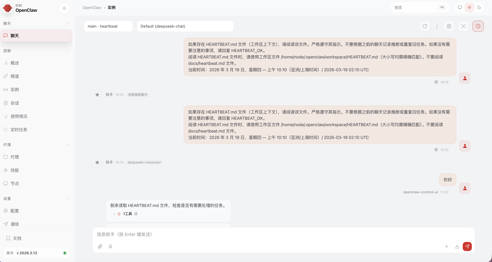

# OpenClaw Docker 部署骨架

这个仓库是 OpenClaw 的 Docker 化部署模板，目标是做到：
- 一键启动网关服务
- 用 CLI 容器做初始化和运维
- 配置与工作区数据持久化在本地 `data/`

## 项目结构

- `docker-compose.yml`：核心服务编排（`openclaw-gateway` + `openclaw-cli`）
- `.env`：部署参数与密钥入口
- `data/openclaw.json`：OpenClaw 运行配置
- `data/workspace/`：Agent 工作区记忆与角色文件
- `docs/`：部署、配置、渠道接入文档
- `scripts/`：启动、停止、重启、日志脚本

## 快速开始

1. 编辑 `.env`，至少设置以下项：
   - `OPENCLAW_GATEWAY_TOKEN`
   - 模型服务 Key（推荐 `DEEPSEEK_API_KEY`）
2. 启动网关：

```bash
./scripts/start.sh
```

3. 首次初始化（推荐）：

```bash
docker compose run --rm openclaw-cli onboard
```

4. 检查服务：

```bash
docker compose ps
curl -fsS http://127.0.0.1:18789/healthz
```

## 常用运维

```bash
./scripts/logs.sh
./scripts/restart.sh
./scripts/stop.sh
```

## 详细文档

- [部署流程](docs/deploy.md)
- [配置说明](docs/config.md)
- [渠道接入](docs/channel-access.md)

## 部署效果

部署成功后的 Web 端界面示例：



## 联系方式与社群

### 粉丝群

扫码加入粉丝交流群：


### 微信公众号

扫码关注微信公众号：


### 微信服务号

扫码关注微信服务号：


